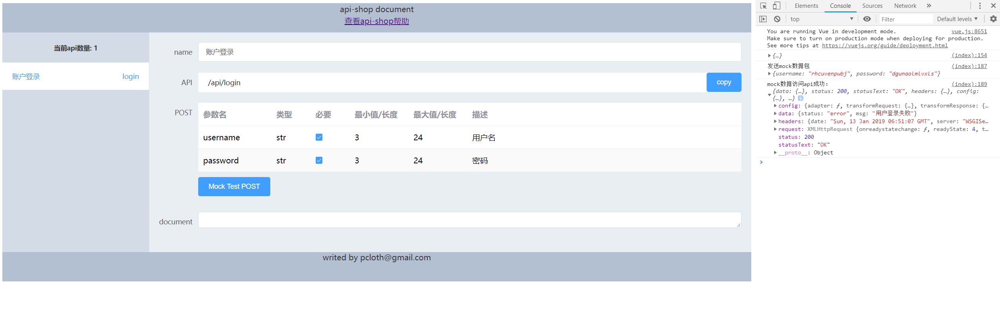

# api-shop api商店

## 什么是api-shop：提供易用的、轻量化的restful-api接口工具包，基于django或者flask框架。

## 核心功能：

### 1、配置化api生成。
### 2、根据配置自动校验request提交的数据，并转换成制定格式。
### 3、根据配置自动生成api文档，并提供一个web页面可供查询和mock数据演示，方便和前端开发人员沟通。
### 4、兼容django 和 flask（下一个版本提供）

# demo 图片



## 使用方法：
### 安装：
```sh
sudo pip install api-shop
```

### 引入：
```python
from api_shop from ApiShop,Api
# ApiShop 是构造类
# Api是接口类
```

### Django例子：
```python
## urls.py
from api_shop import ApiShop

## 接口配置数据
conf = [
    {
        'url': 'login',
        'class': 'account.views.api_login', #需要引入的api类，继承于上面说的Api接口类
        'name': '账户登录',
        'methods': {
            'POST': [
                {'name':'username', 'type': str, 'required': True, 'min': 3, 'max': 24, 'description': '用户名'},
                {'name':'password', 'type': str, 'required': True, 'min': 3, 'max': 24, 'description': '密码'},
            ]
            ## 这里可以插入更多的methods，比如GET,DELETE,POST,PATCH
        }
    },
    ## 这里可以插入更多的api接口

]

## api-shop参数设置：

options = {
            'base_url':'/api/',# 基础url，用以组合给前端的api url 可默认
            # 'document':BASE_DIR+'/api_shop/static/document.html', # 文档路由渲染的模板 可默认
            'bad_request':True, # 参数bad_request如果是真，发生错误返回一个坏请求给前端，否则都返回200的response，里面附带status=error和msg附带错误信息 可默认
        }


af = ApiShop(conf,options)

app_name='api'

urlpatterns = [
    path('api_data', af.get_api_data, name='api_data'), # api文档需要的接口
    path('document/', af.render_documents, name='document'), #api文档渲染的路由
    re_path(r'([\s\S]*)', af.api_entry, name='index') # 接管api/下面其他的全部路由到api_entry入口方法
]

```

### 
```python
## account/views.py
from api_shop from Api

class api_login(Api):
    def post(self,request,data=None):
        '''api登陆接口，方便微信用户绑定账户'''
        username = data.username
        password = data.password
        user = authenticate(username=username, password=password)
        if user:
            login(request, user)
            token = TokenBackend.make_token(user).decode('utf-8')
            return JsonResponse({'status': 'success', 'msg': '执行成功', 'token': token})
        
        return JsonResponse({'status': 'error', 'msg': '用户登录失败'})
```


