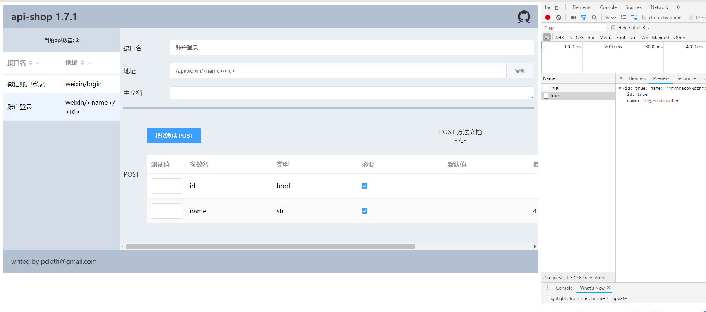

# 文档和mock工具

::: tip 
- api-shop 提供了一个基于vue和element-ui的api接口在线文档和mock工具页面
:::



## 配置文档路由
- 在ApiShop组件实例中，有一个方法render_documents(request,url)
- 和它配套的，必须有一个get_api_data(request,url)方法，用于文档获取接口数据。

``` python
# flask例子，省略了conf配置和引入部分代码。
af = ApiShop(conf)

@app.route('/api/<regex("([\s\S]*)"):url>',methods=['GET', 'POST','PUT','DELETE','PATCH'])
def hello_world(url):
    print(url)
    if url=='documents/':
        # 这里配置的就是访问文档的路由
        return af.render_documents(request,url)
    if url=='api_data':
        # 这里是文档需要的数据接口
        return af.get_api_data(request,url)
    
    return af.api_entry(request,url)
```

#### 这样，在浏览器中就可以通过 `yourhost/api/documents/`  访问到在线文档，把它给你的前端组员，可以减少很多不必要的沟通。
#### 内置的在线文档还提供了一个简单的mock工具，方便前端人员调试接口。


## 自定义文档模板
::: tip
- 你如果不满意文档样式，可以自行编写文档模板。
:::

### 文档页面业务流程
1. 页面加载完成后，请优先访问你配置好的api_data接口，获取所有的接口数据。
2. 根据接口数据包渲染你的页面和配置mock工具
3. 在ApiShop实例化的时候，将新的文档实际路径写到options.document项目中
```python
options = {
    'document': BASE_DIR + '/static/document.html',  # 请填写绝对路径
}
```